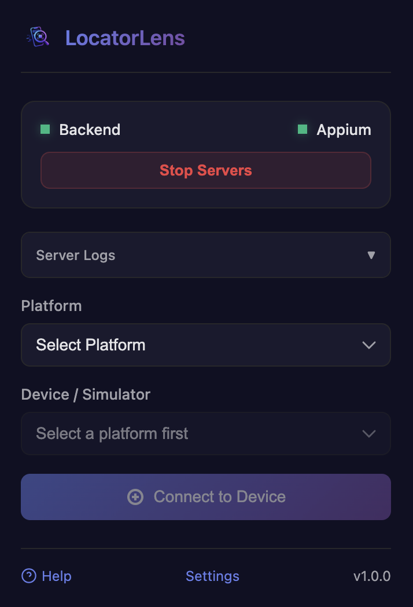
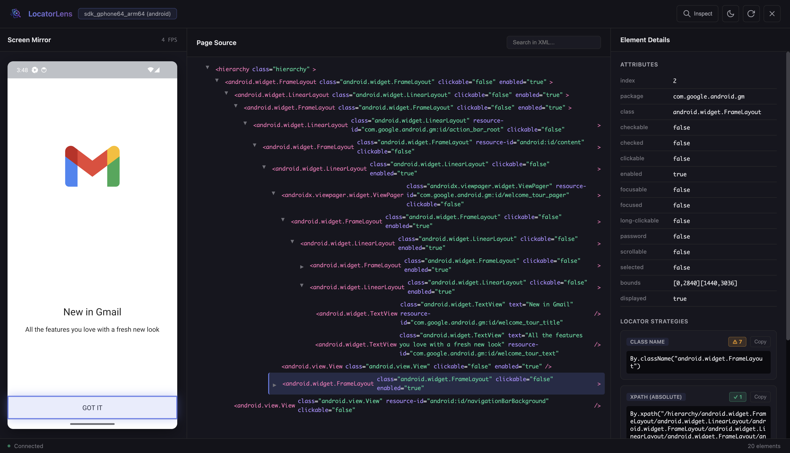
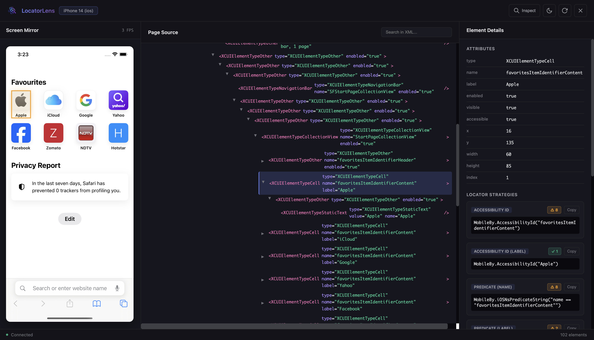

<h1> LocatorLens</h1>

**Real-time Element Inspector & Locator Generator for Appium (Android & iOS)**

Inspect mobile app elements, generate locators, and see a live screen mirror — all from your browser. Works with **any app on any device**, no code changes or app modifications required.


---

## Table of Contents

- [Features](#features)
- [Overview](#overview)
- [Quick Start](#quick-start)
- [Prerequisites](#prerequisites)
- [Installation](#installation)
- [How It Works](#how-it-works)
- [Settings](#settings)
- [Platform Support](#platform-support)
- [LocatorLens and Appium Inspector Workflows](#locatorlens-and-appium-inspector-workflows)
- [Troubleshooting](#troubleshooting)
- [Project Structure](#project-structure)
- [License](#license)

---

## Features

**Inspector**
- **Works with any app** — inspect any foreground app without reconfiguration
- **Live Screen Mirror** — see your device screen in real time at up to 30 FPS
- **Click to Inspect** — click anywhere on the mirrored screen to select that element
- **Hover to Highlight** — hover over elements in the tree to highlight them on screen
- **Visual Element Tree** — full XML hierarchy browser with expand/collapse
- **Search Elements** — filter the element tree by attribute name or value
- **Auto-refresh** — detects screen changes and refreshes page source automatically

**Locator Generation**
- **All strategies at once** — XPath, Resource ID, Content Description, UIAutomator2, Accessibility ID, iOS Class Chain, NSPredicate String
- **Ranked by reliability** — best locators shown first (ID > Accessibility > XPath)
- **Uniqueness badge** — green checkmark if unique, orange warning if multiple elements match
- **One-click copy** — copy any locator directly to your clipboard

**Developer Experience**
- **Appium Methods Preview** — see what `getText()`, `getAttribute()`, `getRect()`, `isEnabled()` etc. would return for the selected element, before writing a single line of test code
- **Interact Mode** — tap elements directly from the browser to navigate the app
- **Dark / Light theme** — persists across sessions
- **Auto-reconnect** — WebSocket reconnects automatically if the backend restarts
- **Built-in log viewer** — filterable, full-page log view with Info / Warning / Error levels

---
## Overview
### Extension Home

Start and monitor the LocatorLens servers directly from the Chrome extension popup.

<p align="center">
  
</p>

### Inspector

Inspect any foreground app, view the live screen mirror, browse the element tree, and copy generated locators in one place.





---

## Quick Start

> Get up and running in under 5 minutes.

1. **Install prerequisites** — Node.js 18+, Appium 2.x, and the relevant driver (see [Prerequisites](#prerequisites))
2. **Install the extension** — from the Chrome Web Store or load unpacked (see [Installation](#installation))
3. **Run the auto setup installer** — from the extension's Settings page
4. **Connect your device** — start your Android device (USB debugging on) or boot an iOS simulator
5. **Click the extension icon** → **Start Servers** → select platform and device → **Connect**
6. **Start inspecting** — click any element on the screen mirror to see all its locators

That's it. Open any app on your device and keep inspecting — no reconnection needed.

---

## Prerequisites

| Requirement | Version | Purpose | Install |
|-------------|---------|---------|---------|
| **Node.js** | 18+ | Runs the backend server | [nodejs.org](https://nodejs.org) |
| **Appium** | 2.x | Mobile automation server | `npm install -g appium` |
| **UIAutomator2 driver** | latest | Android support | `appium driver install uiautomator2` |
| **XCUITest driver** | latest | iOS support (macOS only) | `appium driver install xcuitest` |
| **ADB** | latest | Android device communication | [Android Platform Tools](https://developer.android.com/studio/releases/platform-tools) |
| **Xcode** | latest | iOS simulator support (macOS only) | Mac App Store |

---

## Installation

### Option 1 — Chrome Web Store (Recommended)

1. Install **LocatorLens** from the Chrome Web Store after the listing is approved
2. Click the extension icon → **Settings**
3. Follow the **Setup Guide** on the settings page — it downloads the auto setup installer and registers the local companion

### Option 2 — Load Unpacked (Developers)

```bash
# Clone the repo
git clone https://github.com/pritesh1991/LocatorLens.git
cd LocatorLens

# Install backend dependencies
cd backend && npm install && cd ..
```

Then load the extension in Chrome:

1. Go to `chrome://extensions`
2. Enable **Developer Mode** (top right)
3. Click **Load Unpacked** → select the `/extension` folder

Then install the local companion from the extension itself:

1. Open the loaded LocatorLens extension's **Settings** page
2. Download the auto setup installer for your platform
3. Run the downloaded installer, then reload the extension

The Settings-page installer bakes in your actual unpacked extension ID. If you run the repository installer directly, pass your extension ID explicitly:

```bash
# macOS / Linux
bash extension/installers/install_host.sh --extension-id <your-extension-id>

# Windows (Command Prompt)
extension\installers\install_host.bat --extension-id <your-extension-id>
```

### Build the Chrome Web Store Package

```bash
# Generate Chrome Web Store screenshot and promo assets
npm run prepare:store-assets

# Build dist/locatorlens-companion-v1.0.0.zip, copy it into extension/installers/,
# and update installer checksum metadata
npm run build:companion

# Create locatorlens-extension.zip for upload
npm run package:extension
```

The Chrome Web Store upload ZIP is `locatorlens-extension.zip`; upload that file, not `extension.crx`. The Options-page installer embeds the companion archive from the extension package, so setup does not depend on a GitHub release being public. If you want a public release URL as a fallback, build with `LOCATORLENS_COMPANION_URL=<public asset URL> npm run build:companion`.

---

## How It Works

```
[Chrome Extension]
       |  native messaging
       v
[Native Host (Node.js)]  ──starts──►  [Backend Server :8765]
                                               │
                              WebSocket / REST │
                                               ▼
                                      [Appium Server :4723]
                                               │
                                               ▼
                                    [Android / iOS Device]
                                    (any app, any screen)
```

1. Extension sends a `start` command to a native host via Chrome's native messaging API
2. Native host starts the Node.js backend and Appium server
3. Extension connects to the backend over WebSocket for live screen streaming
4. Backend uses Appium to capture screenshots and page source XML for whatever app is in the foreground
5. Extension renders the screen mirror and generates locators from the XML

---

## Settings

Open the extension **Settings** page to configure:

| Setting | Default | Description |
|---------|---------|-------------|
| Backend Port | `8765` | Port the Node.js backend listens on |
| Appium URL | `http://localhost:4723` | Appium server address and port |
| Screen Mirror FPS | `3` | Frames per second for live screen streaming (1–30) |

Settings take effect on the next **Start Servers**.

---

## Platform Support

| Platform | Android | iOS Simulator | Notes |
|----------|:-------:|:------------:|-------|
| macOS | ✅ | ✅ | Full support |
| Windows | ✅ | ❌ | iOS requires macOS |
| Linux | ✅ | ❌ | iOS requires macOS |

---

## LocatorLens and Appium Inspector Workflows

LocatorLens is built for Appium-based workflows and is inspired by the fast visual feedback people expect from inspector tools like Appium Inspector. LocatorLens is an independent Chrome extension and is not affiliated with or endorsed by the Appium project.

| Feature | LocatorLens | Appium Inspector / Desktop Inspector Workflow |
|---------|:-----------:|:----------------:|
| **Distribution** | Chrome Extension — no install, auto-updates | Desktop app — manual download & updates |
| **Startup** | One click | Manual: start Appium, configure capabilities, create session |
| **Session setup** | Zero config — inspects whatever is on screen | Requires capabilities JSON per app |
| **Live screen mirror** | ✅ Continuous up to 30 FPS | ❌ Static snapshot |
| **Auto-refresh on change** | ✅ Detects screen changes automatically | ❌ Manual refresh |
| **Multi-strategy output** | ✅ All 7+ strategies simultaneously | One at a time |
| **Uniqueness validation** | ✅ Match count badge | ❌ Not available |
| **Click to inspect** | ✅ On live mirror | Static screenshot |
| **Interact mode** | ✅ Tap from browser | Separate panel |
| **App switching** | ✅ Any app, no reconfiguration | New session required |
| **Log viewer** | ✅ Built-in with filtering | Separate terminal |
| **Dark / light theme** | ✅ | Varies by tool |

**When to use Appium Inspector or desktop inspector tools:** Deep session configuration, remote automation grids, advanced capability tweaking.

**When to use LocatorLens:** Day-to-day locator building, exploratory testing, fast iteration.

---

## Troubleshooting

| Issue | Solution |
|-------|---------|
| "Native messaging host not found" | Re-run the installer from Settings and reload the extension |
| "Access forbidden" error | Re-run the installer (extension ID changed), then reload |
| Servers won't start | Check the log viewer in the popup. Ensure Node.js ≥ 18 is installed |
| Appium not found | `npm install -g appium` (use Command Prompt on Windows, not PowerShell) |
| UiAutomator2 driver missing | `appium driver install uiautomator2` |
| No Android devices listed | Enable USB debugging. Run `adb devices` in terminal |
| No iOS simulators listed | Boot a simulator in Xcode first (macOS only) |
| Screen capture fails | Check logs. Try disconnecting and reconnecting |
| Backend dependencies missing | Re-run the installer — it runs `npm install` automatically |

**Log file location:**
- macOS / Linux: `~/.locatorlens/native-host.log`
- Windows: `%USERPROFILE%\.locatorlens\native-host.log`

---

## Project Structure

```
locatorlens/
├── backend/                    # Node.js REST + WebSocket server
│   ├── server.js
│   ├── appium-client.js
│   ├── device-manager.js
│   ├── screen-mirror.js
│   └── config.js
├── extension/                  # Chrome Extension (Manifest V3)
│   ├── manifest.json
│   ├── background.js
│   ├── popup/
│   ├── inspector/
│   ├── options.html / options.js
│   ├── logs.html / logs.js
│   └── installers/             # auto setup installers + companion metadata
├── native-host/                # Native messaging host
│   └── launcher.js
└── README.md
```

---

## License

[MIT](LICENSE)
